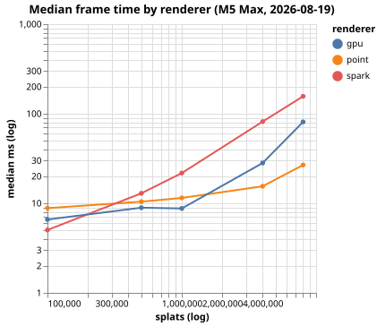
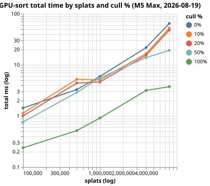

# Benchmarks

Rendering performance for the three splat renderers (`point`, `spark`, `gpu`)
on synthetic splat clouds. All numbers are GPU frame times in milliseconds.

- **Machine:** MacBook Pro | Apple M5 Max | 128 GB
- **Date:** 2026-08-19
- **Build:** `--configuration release`

## Reproduce

```sh
just benchmark    # renderer comparison table (section 1)
just sort-perf    # per-pass GPU-sort timings (section 2)
```

Both recipes print a device/date header and a markdown table. To refresh this
file, run each recipe and paste its output into the matching section below.
Under the hood they run `swift run --configuration release
metalsprockets-gaussian-splat bench ...` and format the CSV/JSON with `duckdb`.

`just sort-perf` accepts overrides:

```sh
just sort-perf counts="100000,1000000" cull="0,50,100" iterations="240"
```

## 1. Renderer comparison

Median / p10 / p90 frame time per renderer across cloud sizes.
Lower is better; `label` == `splats` here.



Device: MacBook Pro | Apple M5 Max | 128 GB
Date:   2026-08-19 11:53

|  label  | splats  | renderer |     median_ms      |       p10_ms       |       p90_ms       |
|--------:|--------:|----------|-------------------:|-------------------:|-------------------:|
| 100000  | 100000  | point    | 8.834583           | 8.336875000000001  | 9.944583           |
| 100000  | 100000  | spark    | 5.0365             | 4.484292           | 9.413791000000002  |
| 100000  | 100000  | gpu      | 6.590792           | 5.678083000000001  | 11.474041000000001 |
| 500000  | 500000  | point    | 10.430125          | 10.173083000000002 | 10.895125          |
| 500000  | 500000  | spark    | 12.933750000000002 | 11.646708          | 17.375958999999998 |
| 500000  | 500000  | gpu      | 8.936459000000001  | 6.616167           | 11.586292000000002 |
| 1000000 | 1000000 | point    | 11.486667          | 11.240042          | 11.778708          |
| 1000000 | 1000000 | spark    | 21.761000000000003 | 19.721833          | 27.471417000000002 |
| 1000000 | 1000000 | gpu      | 8.759875000000001  | 7.876208000000001  | 16.328250000000004 |
| 4000000 | 4000000 | point    | 15.498417          | 15.336500000000001 | 15.847292000000003 |
| 4000000 | 4000000 | spark    | 81.742917          | 78.853834          | 89.484125          |
| 4000000 | 4000000 | gpu      | 28.199500000000004 | 20.786208000000002 | 33.662375000000004 |
| 8000000 | 8000000 | point    | 26.776458          | 21.457667000000004 | 37.79075           |
| 8000000 | 8000000 | spark    | 156.53975          | 151.64837500000002 | 175.84954100000002 |
| 8000000 | 8000000 | gpu      | 81.05683300000001  | 59.171083          | 108.53666700000001 |

## 2. GPU-sort per-pass timings

Detailed per-pass medians for the `gpu` renderer across cloud sizes × cull
percentages. `target_cull` is the requested cull %, `actual_cull` what the
GPU culler produced. `sort_ms` + `render_ms` roughly sum to `total_ms`;
`submit_ms` is the full command-buffer time.



Device: MacBook Pro | Apple M5 Max | 128 GB
Date:   2026-08-19 11:54

| splats  | target_cull | actual_cull | visible | culled  | sort_ms | render_ms | vertex_ms | fragment_ms | total_ms | submit_ms |
|--------:|------------:|------------:|--------:|--------:|--------:|----------:|----------:|------------:|---------:|----------:|
| 100000  | 0           | 0.0         | 100000  | 0       | 0.37    | 1.057     | 0.455     | 0.581       | 1.437    | 1.445     |
| 100000  | 10          | 10.0        | 89993   | 10007   | 0.375   | 0.758     | 0.245     | 0.513       | 1.14     | 1.149     |
| 100000  | 20          | 20.0        | 80004   | 19996   | 0.363   | 0.643     | 0.206     | 0.437       | 1.005    | 1.013     |
| 100000  | 50          | 50.0        | 49983   | 50017   | 0.333   | 0.431     | 0.135     | 0.296       | 0.764    | 0.771     |
| 100000  | 100         | 100.0       | 0       | 100000  | 0.204   | 0.036     | 0.007     | 0.029       | 0.239    | 0.244     |
| 500000  | 0           | 0.0         | 500000  | 0       | 0.836   | 2.487     | 1.086     | 1.406       | 3.292    | 3.298     |
| 500000  | 10          | 10.0        | 450048  | 49952   | 1.454   | 3.784     | 1.176     | 2.616       | 5.243    | 5.256     |
| 500000  | 20          | 20.0        | 400033  | 99967   | 1.321   | 3.074     | 0.968     | 2.107       | 4.419    | 4.427     |
| 500000  | 50          | 50.0        | 249915  | 250085  | 0.934   | 1.939     | 0.603     | 1.334       | 2.893    | 2.9       |
| 500000  | 100         | 100.0       | 1       | 499999  | 0.468   | 0.047     | 0.018     | 0.029       | 0.518    | 0.527     |
| 1000000 | 0           | 0.0         | 1000000 | 0       | 1.213   | 4.73      | 2.007     | 2.757       | 5.942    | 5.948     |
| 1000000 | 10          | 10.0        | 899967  | 100033  | 1.51    | 3.602     | 1.118     | 2.469       | 5.102    | 5.109     |
| 1000000 | 20          | 20.0        | 799879  | 200121  | 1.458   | 3.192     | 0.901     | 2.308       | 4.629    | 4.636     |
| 1000000 | 50          | 50.0        | 499916  | 500084  | 1.647   | 3.9       | 1.225     | 2.676       | 5.548    | 5.556     |
| 1000000 | 100         | 100.0       | 0       | 1000000 | 0.875   | 0.036     | 0.007     | 0.029       | 0.912    | 0.923     |
| 4000000 | 0           | 0.0         | 4000000 | 0       | 4.853   | 16.988    | 6.029     | 11.366      | 21.84    | 21.847    |
| 4000000 | 10          | 10.0        | 3599629 | 400371  | 3.976   | 12.509    | 2.733     | 9.522       | 16.688   | 16.694    |
| 4000000 | 20          | 20.0        | 3199677 | 800323  | 4.154   | 11.195    | 2.756     | 8.223       | 15.509   | 15.514    |
| 4000000 | 50          | 50.0        | 1999364 | 2000636 | 3.863   | 9.776     | 2.556     | 7.107       | 13.903   | 13.91     |
| 4000000 | 100         | 100.0       | 1       | 3999999 | 3.117   | 0.047     | 0.018     | 0.029       | 3.166    | 3.169     |
| 8000000 | 0           | 0.0         | 8000000 | 0       | 12.197  | 53.096    | 14.855    | 37.803      | 64.69    | 64.697    |
| 8000000 | 10          | 10.0        | 7199608 | 800392  | 11.872  | 40.706    | 7.551     | 32.823      | 52.503   | 52.509    |
| 8000000 | 20          | 20.0        | 6399641 | 1600359 | 11.027  | 37.412    | 7.084     | 30.406      | 48.159   | 48.165    |
| 8000000 | 50          | 50.0        | 4000586 | 3999414 | 6.35    | 12.677    | 3.215     | 9.437       | 19.281   | 19.306    |
| 8000000 | 100         | 100.0       | 3       | 7999997 | 3.698   | 0.034     | 0.013     | 0.02        | 3.75     | 3.753     |
