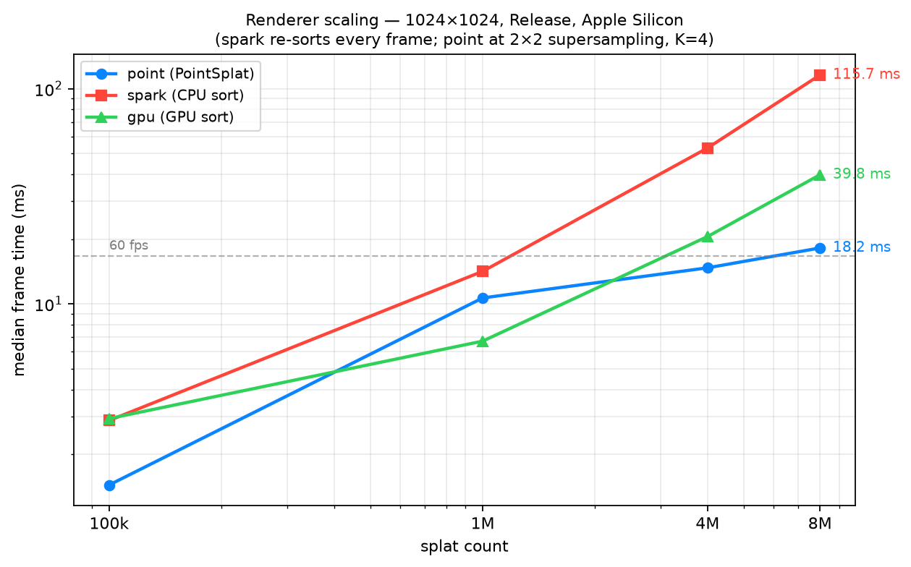

# MetalSprockets Gaussian Splats

Gaussian Splat rendering built on [MetalSprockets](https://metalsprockets/com) ([Github](https://github.com/schwa/MetalSprockets)).

This repository has a standalone renderer and a Swift framework. You can add the framework to your own project.

There is also a CLI target for offline rendering. See the Justfile for how to use it.

The Wikipedia article is a good summary of the technique: [Wikipedia](https://en.wikipedia.org/wiki/Gaussian_splatting)

## Requirements

- Any current iOS device or Apple Silicon Mac.
- This project needs macOS 26/iOS 26 now. You can backport it with little effort.
- **Simulators are not supported.** The Spark pipeline uses nested Metal
  argument buffers. Simulator Metal rejects these buffers. As a result, splat
  rendering shows nothing in the iOS/visionOS simulators. Run on a real
  device, or run natively on macOS.

## Renderers

The framework has five renderers that you can exchange. Select one in the demo
app's picker, or with the `.splatRenderer(_:)` modifier on `SplatView`:

```swift
SplatView(splatCloud: cloud, cameraMatrix: cameraMatrix)
    .splatRenderer(.spark)   // or .gpu, .tile, .stochastic, .point
```

You can also use each renderer directly as a MetalSprockets element. The
snippets below show the minimum per-frame construction. See `SplatView.swift`
for the complete wiring.

### Spark (`.spark`)

The default production renderer. It is ported from [sparkjs](http://sparkjs.dev).

- **Technique:** classic sorted splatting. A CPU radix sort orders the splats
  back-to-front each time the camera moves. Each splat rasterizes as an
  alpha-blended quad. The projected 2D covariance sets the quad size. Spark
  supports spherical harmonics and multiple clouds.
- **Requirements:** any Apple Silicon Mac or current iOS device.
- **Performance:** best quality-per-watt for small and medium scenes (hundreds
  of k splats). The CPU sort runs async, so frames never block on it. But
  the sort latency shows as slight popping during fast camera motion, and the
  sort time grows with the splat count.
- **Debug vs Release:** the CPU radix sort is much slower in Debug
  builds, because the Swift is unoptimized. This shows as slow resorting and
  strong popping during orbit. Benchmark and demo in Release. A slow
  sort (more than 16 ms) logs a warning in both builds.

```swift
try RenderPass {
    try SparkSplatRenderPipeline(
        splatCloud: cloud,
        projectionMatrix: projectionMatrix,
        modelMatrix: .identity,
        cameraMatrix: cameraMatrix,
        drawableSize: size,
        sortedIndices: sortedIndices   // from AsyncSortManager
    )
}
```

### GPU (`.gpu`)

Spark's shading with a GPU sort front-end.

- **Technique:** frustum cull, then stable compaction, then an 8-bit LSD radix
  sort. All of these run on the GPU timeline. They feed the same quad renderer
  with an indirect draw. There is no CPU sort latency, and culled splats never
  rasterize.
- **Requirements:** same as Spark.
- **Performance:** this renderer wins when the camera moves constantly, because
  the sort is never stale. It also wins when culling discards a large part of
  the cloud. It adds a fixed GPU cost per frame for the sort. So Spark is
  cheaper for static views of small scenes.

```swift
let resources = try GPUSortResources(device: device, capacity: cloud.count)  // once

try GPUSortedSplatRenderPipeline(
    splatCloud: cloud,
    projectionMatrix: projectionMatrix,
    modelMatrix: .identity,
    cameraMatrix: cameraMatrix,
    drawableSize: size,
    resources: resources
)
```

### Tile (`.tile`) — experimental

- **Technique:** the screen is divided into tiles. The splats are binned per
  tile, then sorted per tile by depth, then composited front-to-back in an
  imageblock fragment shader. This follows the original 3DGS rasterizer.
- **Requirements:** Apple Silicon (imageblocks / tile shaders).
- **Performance:** work in progress. Tiles with many overlapping splats
  dominate the frame time, because the load balancing is poor. This is the
  known weakness of tile-based splatting at scale.

```swift
try TileBasedSplatPass(
    splatCloud: cloud,
    projection: projection,
    drawableSize: size,
    cameraMatrix: cameraMatrix
)
```

### Stochastic (`.stochastic`) — experimental

- **Technique:** sort-free. Each splat rasterizes as an opaque quad. Each
  fragment passes a probabilistic alpha test (stochastic transparency), with
  blue-noise or hash sampling. This gives correct expected transparency
  without any depth order. The noise averages out over frames.
- **Requirements:** same as Spark.
- **Performance:** there is no sort cost. But the fragment cost grows with
  screen-space overdraw, because every quad still rasterizes fully. The result
  is visibly noisy at 1 sample per pixel. This renderer is for temporal
  accumulation.

```swift
try RenderPass {
    try StochasticSplatRenderPipeline(
        splatCloud: cloud,
        projectionMatrix: projectionMatrix,
        modelMatrix: .identity,
        cameraMatrix: cameraMatrix,
        drawableSize: size,
        frameTime: frameIndex
    )
    .depthCompare(function: .less, enabled: true)
}
```

### PointSplat (`.point`) — experimental

An implementation of *Gaussian Point Splatting* (Rijsdijk et al., SIGGRAPH
2026). See `RFCs/0003-gaussian-point-splatting.md`.

- **Technique:** sort-free and rasterization-free. Each Gaussian
  stochastically emits pixel-sized opaque points. The point count is
  proportional to the screen area times the opacity, with an exact
  collision-compensating correction. The points are splatted into a 64-bit
  depth-and-color buffer with `atomic_min`, so the closest point wins per
  pixel. 2×2 supersampling, a box-filter resolve, and temporal accumulation
  converge the result to the sorted output.
- **Requirements:** 64-bit atomics. This needs the Apple9 GPU family (A17/M3)
  or later, or Mac2.
- **Performance:** the cost grows with the number of points splatted, not with
  the sort size or the overdraw. The points are bounded per frame and evenly
  distributed across the threads. So the frame times stay flat as the splat
  count grows into the millions, where the sorted pipelines degrade. Single
  frames are noisy. Static views converge within tens of frames through
  accumulation. The per-frame point budget is derived automatically (32 points
  per supersampled pixel).

```swift
try PointSplatRenderPipeline(
    splatCloud: cloud,
    projectionMatrix: projectionMatrix,
    modelMatrix: .identity,
    cameraMatrix: cameraMatrix,
    drawableSize: size,
    frameIndex: frameIndex
)
```

## Benchmarks

PointSplat stays nearly flat as the splat count grows. Spark and GPU-sort grow
with the splat count. See the full tables, charts, and per-pass timings in
[Documentation/Benchmark.md](Documentation/Benchmark.md).



## Usage

Rendering Gaussian splats needs two steps: sorting and rendering. The sort
manager runs on a background thread. It produces sorted indices that you pass
to a render pipeline.

### Interactive Rendering (SwiftUI)

```swift
@State private var sortedIndices: SplatIndices?

var body: some View {
    RenderView { _, drawableSize in
        if let sortedIndices {
            try RenderPass {
                try SparkSplatRenderPipeline(
                    splatCloud: cloud,
                    projectionMatrix: projectionMatrix,
                    modelMatrix: .identity,
                    cameraMatrix: cameraMatrix,
                    drawableSize: SIMD2<Float>(drawableSize),
                    sortedIndices: sortedIndices
                )
            }
        }
    }
    .task {
        for await indices in sortManager.sortedIndicesStream {
            sortedIndices = indices
        }
    }
    .onChange(of: cameraMatrix, initial: true) {
        sortManager.requestSort(SortParameters(camera: cameraMatrix, model: .identity))
    }
}
```

### Offline / Single-Frame Rendering

```swift
let sortManager = try AsyncSortManager(device: device, splatCloud: cloud, capacity: cloud.count)
let sortedIndices = try sortManager.sortNowSync(SortParameters(camera: cameraMatrix, model: .identity))

let renderPass = try RenderPass {
    try SparkSplatRenderPipeline(
        splatCloud: cloud,
        projectionMatrix: projectionMatrix,
        modelMatrix: .identity,
        cameraMatrix: cameraMatrix,
        drawableSize: drawableSize,
        sortedIndices: sortedIndices
    )
}
```

The render pipelines are pure rendering elements. They do not manage the
sorting or the async state. The caller owns the `AsyncSortManager`. The caller
subscribes to its `sortedIndicesStream`, requests a sort when the camera moves,
and passes the results in.

## Environment Variables

- `MSGS_SORT_LOG` — set this to `1`, `true`, `yes`, or `on`. Then the CPU
  splat sorter emits a per-frame info-level log line with the sort duration and
  the splat count. The default is off, because the logs are noisy at frame
  rate. Slow-sort warnings (more than 16 ms) are always emitted, whatever this
  setting is.

  The logs go to the unified logging system under the subsystem
  `MetalSprocketsGaussianSplats`. Read them in a terminal with:

  ```sh
  log stream --level info --predicate 'subsystem == "MetalSprocketsGaussianSplats"'
  ```

## License

MIT License. See LICENSE file for details.

## Acknowledgments

The two renderers in this project are based on work by the projects below. A
big thanks to their authors for releasing their code under permissive licenses.

• [antimatter15](https://github.com/antimatter15/splat) (MIT license) — for the original GS renderer and the reference that almost everyone starts from.
• [sparkjs](http://sparkjs.dev) (MIT License) — for the clean implementation that makes porting sane.
